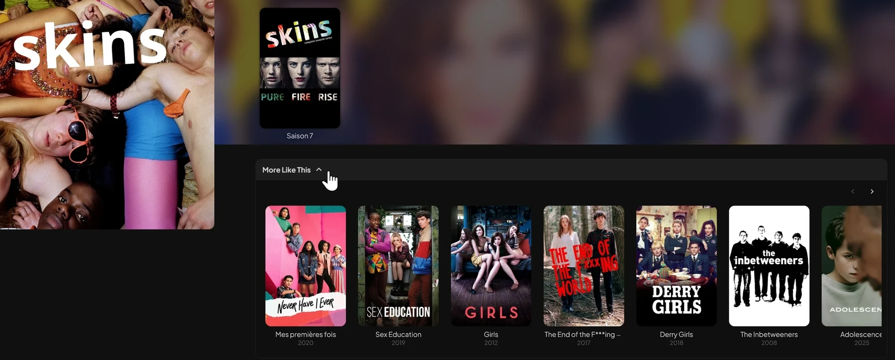

# Jellyfin More Like This (TMDB) 🎬🔗📚

Adds a **More Like This** section to movie and series detail pages. Suggestions come from TMDB (merge `recommendations`, `similar`, and `collections`) and are filtered so that **only titles already present in your Jellyfin library** are shown.

## Features

- Merges TMDB recommendations, similar, and same-collection (sagas)
- Movies in a TMDB collection (saga) are placed first : next film, then previous film (configurable)
- Dropdown menu, collapsed by default, nothing runs (no API call, no library scan) until the section is expanded
- The row is inserted right below Cast & Crew (below the Scenes row when chapter images are shown)
- Runs per user with that user's library access rights
- Compatible with custom themes, uses Jellyfin's native poster layout
- Compatible with other scripts and plugins, such as Kefintweaks and JellyFrame
- Compatibility to use with my Jellyfin Episodes Ratings Grid script
- Option to hide Jellyfin's own built-in "More Like This" row which is slow and inaccurate, hidden by default
- Fully configurable (saga behavior, number of results, cache lifetimes, UI language, etc.)


## Requirements

- Jellyfin 10.11.x (tested on 10.11.11, built on stable REST endpoints with 12.0 in mind)
- [JavaScript Injector](https://github.com/n00bcodr/Jellyfin-JavaScript-Injector) plugin
- A free TMDB API key (get a key by creating an account at https://www.themoviedb.org/settings/api)

## Transparency

- Heavily LLM-assisted
- Human involvement was required to optimize the process, despite JavaScript repeatedly trying to hurt the human.

## Screenshots

<p align="center">
  <br>
</p>

## Installation

#### 1. Create a TMDB API key at <https://www.themoviedb.org/settings/api>

#### 2. Install the [**Jellyfin JavaScript Injector plugin**](https://github.com/n00bcodr/Jellyfin-JavaScript-Injector) in your Jellyfin server if it is not already installed (may need server reboot)

#### 3. Open the Jellyfin admin ***dashboard***

#### 4. Go to: ***Dashboard*** => ***JS Injector***

#### 5. ***Add Script*** => Name it *jellyfin-tmdb-reco* or whatever

#### 6.  Copy/Paste the full content of [`jellyfin-tmdb-more-like-this.js`](https://github.com/Damocles-fr/jellyfin-tmdb-more-like-this/releases/download/0.9/jellyfin-tmdb-more-like-this.js)

#### 7. At the top of the script, in the `CONFIGURATION` block, replace PASTE_YOUR_TMDB_API_KEY_HERE with your key, example :

   ```js
   const TMDB_API_KEY = '123xx123xxx123x133xyz'
   ```

#### 8. Save and reload the web UI. Open any movie or series detail page and expand the "More Like This" bar.

###### Note : if the key is missing or left as the placeholder, the section displays an explicit message instead of failing silently.

###### Note : your API key lives only inside your injected script on your own server. If you share or publish a modified copy of the script, remove your key first.

## Configuration

All options sit in the `SETTINGS` object at the top of the script.

| Option | Default | Description |
| --- | --- | --- |
| `maxResults` | `20` | 1-40. Maximum number of cards displayed (if available in your library) |
| `maxTmdbPages` | `3` | 1-5. Maximum TMDB recommendation pages fetched when fewer matches are found |
| `collectionsFirst` | `true` | Movies only. Place available films from the same TMDB collection (saga) at the head of the row |
| `collectionMax` | `2` | 1-20. Maximum collection films placed first. Order spirals outward from the current movie: next, previous, next+1, previous-1 |
| `showRefresh` | `false` | Show a refresh icon in the open panel to clear caches and reload |
| `hideNativeSimilar` | `true` | Hide Jellyfin's own built-in "More Like This" row (#similarCollapsible) at the page bottom |
| `indexTtlHours` | `24` | 1-168. Lifetime of the local library index (localStorage) |
| `tmdbCacheHours` | `24` | 1-168. Lifetime of cached TMDB responses (sessionStorage) |
| `pageSize` | `1500` | 200-5000. Items per request while building the library index |
| `sectionTitle` | `More Like This` | Section title shown in the UI, override for localization or whatever. I was also considering “You May Also Like” or simply “Similar”
| `strings` | see script | All UI text, override for localization |

## Technical

The script is idle until the section is expanded. On activation it reads the current item's TMDB ID from Jellyfin `ProviderIds` (with a TMDB `/find` fallback through IMDb or TVDb when missing), then makes a single TMDB request using `append_to_response=recommendations,similar`. For movies that belong to a TMDB collection, the collection identity comes back for free in that same response, and one additional cached request to the collection endpoint fetches the saga's films so the available ones can be placed first (the current film is excluded, and duplicates against the regular suggestions are removed). Availability is resolved against a small local index of the library: paginated `/Items` requests limited to `Fields=ProviderIds` (images and user data disabled, episodes never fetched) build a `TMDB ID -> Jellyfin ID` map per media type, stored in localStorage for 24 hours, per server and per user. On later activations a one-row `TotalRecordCount` check revalidates the index in the background and rebuilds it silently if the library changed. Jellyfin IDs that no longer resolve are purged automatically. Matched candidates are fetched in one batched `/Items?ids=` request and rendered with Jellyfin's native card markup, so themes and hover scripts treat them like built-in cards. Because matching uses TMDB IDs exclusively, results are independent of the metadata language configured in Jellyfin.

## Performance

Reference numbers measured on Jellyfin 10.11.11 (NAS over LAN, 3000 movies and 500 series) : first index build takes about 1.2s for movies and 0.25s for series.

## Limitations

- It won't display on Jellyfin apps that do not use the Jellyfin Web UI
- Library items without a TMDB ID in their metadata cannot appear as suggestions (they are invisible to the ID matching)
- Items added to the library today appear after the background revalidation detects a count change, after the 24 h cache expiry, or after pressing Refresh in the panel (see Configuration to display it).

## Need Help?
- Don't hesitate to open an [issue](https://github.com/Damocles-fr/jellyfin-tmdb-more-like-this/issues)
- **DM me** https://forum.jellyfin.org/u-damocles
- GitHub [**Damocles-fr**](https://github.com/Damocles-fr)
